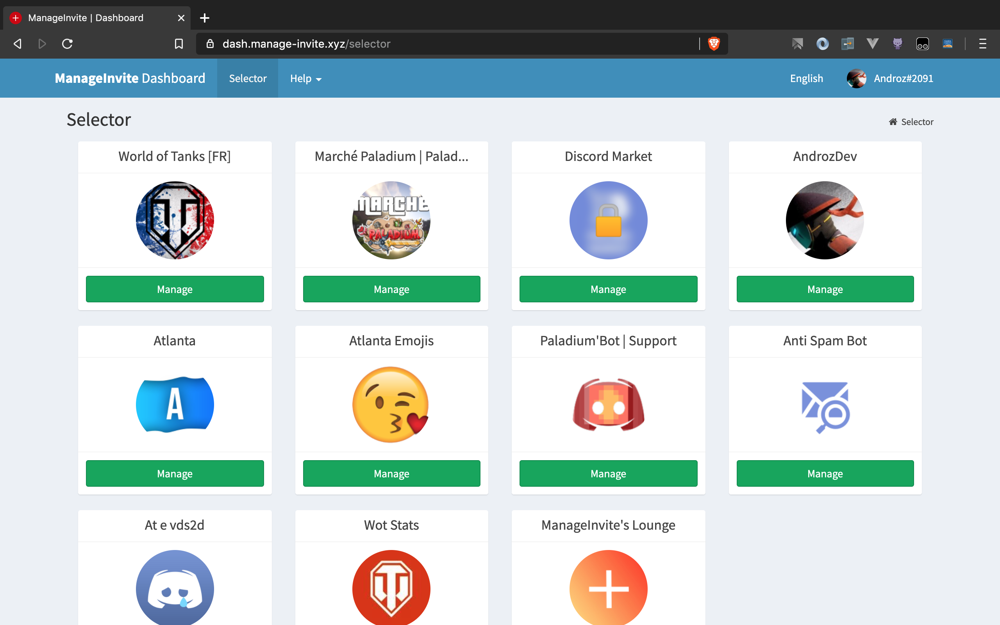
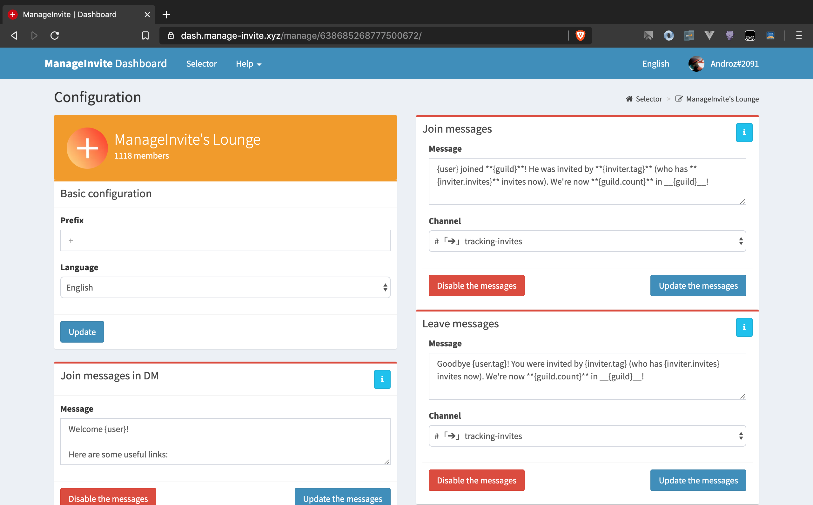

  

# ManageInvite
[](https://github.com/Androz2091/ManageInvite)
[](https://discord.gg/v26Sqqs)
[](https://patreon.com/Androz2091)
[](https://github.com/Androz2091/ManageInvite)

> ManageInvite is used by + 2,000,000 users in + 10,000 servers!

## 🌐 Dashboard

ManageInvite has a powerful dashboard which allow you to manage your servers easily! Configure join/leave messages, change server prefix, server language, etc...

</img>
</img>

## 💪 Features

> **ManageInvite** has a total of 34 commands!

### ⚙️ Config commands

```
+configjoin        Config join messages
+setjoin           Disable/Enabled join messages
+testjoin          Try join messages configuration
```


```
+configdm          Config join messages in dm
+setdm             Disable/Enabled join messages in dm
+testdm            Try join messages in dm configuration
```

```
+configleave       Config leave messages
+setleave          Disable/Enabled leave messages
+testleave         Try leave messages configuration
```

You can use `+config` to show your server global config.

### 🔑 Admin commands

```
+addbonus          Add bonus invites to a member.
+removebonus       Remove bonus invites from a member.
```

```
+addrank           Add a rank to the rank rewards.
+removerank        Remove a rank from the rank rewards.
+ranks             Show the rank rewards list.
```

```
+removeinvites     Clear member or server invites.
+restoreinvites    Restore member or server invites.
+sync-invites      Synchronize ManageInvite database with server invites.
```

### 👤 User commands

Everyone can use user commands, there aren't restricted.

#### Invite command

```
+invites (@user)   Show your invites or the invites of the mentionned member.
+leaderboard       Show the server leaderboard.
+stats             Show a graph with the server joins.
+membercount       Show members stats.
```

#### Infos commands

```
+help              Show the list of the commands.
+botinfos          Show informations about ManageInvite.
+ping              Show the ManageInvite's ping.
+partners          Show the ManageInvite's partners.
+add               Show the ManageInvite's invite link.
+support           Join the support server.
```

### 👑 Owner commands

```
+eval              Execute javascript code.
+reload            Reload a command or languages.
+servers-list      Show the servers list.
```
