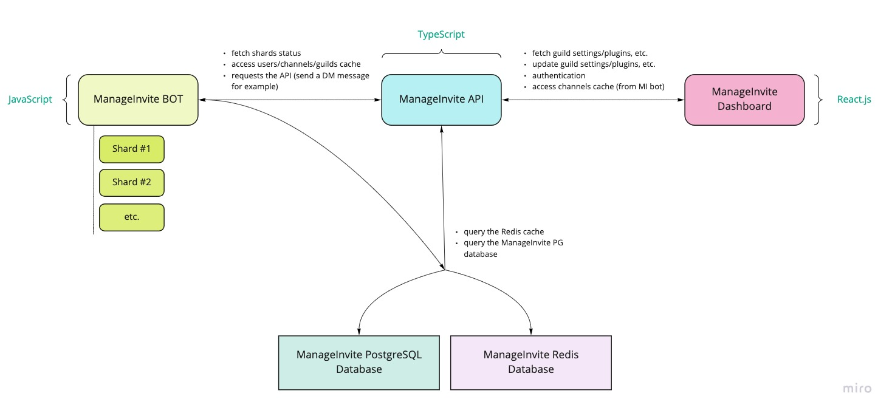

  

# ManageInvite

> ManageInvite is used by + 2,000,000 users in + 10,000 servers!

Choose stability and power, choose ManageInvite. 🚀

## How does it work?

If there is one thing that is important to us as leaders of the ManageInvite project, it is to share our code and knowledge as much as we can. We believe that our users have the right to understand how our product works. Here is a diagram of the infrastructure we use, and the links to the corresponding repositories. 

### Diagram

### Repositories:

* **[ManageInvite BOT](https://github.com/manage-invite/manage-invite-bot)**
* **[ManageInvite API](https://github.com/manage-invite/manage-invite-api)**
* **[ManageInvite Dashboard](https://github.com/manage-invite/manage-invite-dashboard)**

Please note that the code in this repository is **NOT** intended to be hosted. These files are here to help you **understand** how the bot works in general, not how to launch it on your own machine. We are sorry but we will not be able to help you to install the bot on your own server and we are sorry if you wasted your time trying before coming across this message.
